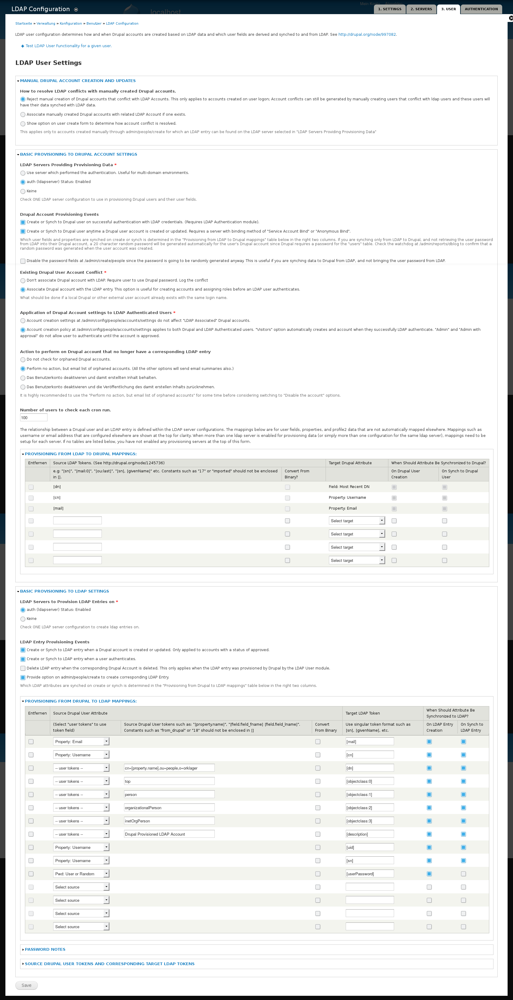

# community
Containerized community bundle using Drupal and phpBB backed by LDAP


# Prerequisites

Have the following tools installed:

* ldap-utils
* mysql-client

Access to some k8s cluster.

# Preparations

You need some volumes to store user data and user content. In detail this is the storage for the LDAP server, for the forum and for the drupal page content. Plug-ins and Themes should be controlled via the Docker images.

The steps described here should be understood when repeating the process. Nevertheless there exists a script `prepare.sh` that performs a lot of the required actions.

I recommend using a unique namespace for the pods of this bundle. 
Declare it and set the context before performing further steps. 
In this example the namespace is the same as the domainname and the shell-variable `$domainname` contains it.
If you source `prepare.sh` the variables are set correspondingly.

```bash
kubectl create namespace $domainname
kubectl config set-context $(kubectl config current-context) --namespace=$domainname
```

## Storage

Setting up the storage is a highly individual aspect. 
Make sure you adapt the contents of this repository to your needs and your environment. 
The example case uses local paths (`hostPath`). 
In production setups this is usually not available and cloud storage should be used.

The LDAP-server needs two folder: one for the config and one for the actual data. 
Additionally the database instances for each Drupal and phpBB also need storage. 
The rest is ephemeral. 
So we end with the following PersistentVolums:

* ldap-data
* ldap-config
* drupal-db
* phpbb-db

The corresponding PersistentVolumeClaims are

* claim-ldap-data
* claim-ldap-config
* claim-drupal-db
* claim-phpbb-db

Create the PersistentVolumes with

```bash
kubectl create -f storage.yaml
```

The claims are made from the same files as the deployments.

## LDAP database

The central element glueing together all the different playgrounds of the online community (phpBB, Drupal and later something like Nextcloud) is the central LDAP server.
Currently this project uses openLDAP, we also evaluate Samba as an alternative.

If you start from scratch it is sufficient to declare the organization and the organizational units within your LDAP-directory. 
This step has to be done, too, if you fill LDAP with older data. 
It is convenient to store the organization as value in a ConfigMap for the automatization of the overall process and the master password in a Secret.

```bash
kubectl create configmap ldap-config --from-literal=config_basedn="o=$domainname"
kubectl create secret generic ldap-pass --from-literal=ldap-passwd=${ldap_pass}
```

The entries will later be controlled from Drupal.
The Docker image `beli/ldap` creates an admin user: `admin...`
Start it:

```bash
kubectl create -f deployment_ldap.yaml
```

The base structure should be something like this:

```ldap
dn: o=your_organization
changetype: add
objectclass: top
objectclass: organization
o: your_organization
```
and the three organizational units `people`, `groups`, and `admin`.
Basic knowledge about LDAP is useful.

The sample structure (as created from `prepare.sh`) can be found in `ldap/basis.ldif`, sample user data in `ldap/users.ldif`
We usually don't need direct access to the LDAP server so no service is defined.
For the initial setup we should open a route so we can address it directly with Linux command line tools:

```bash
kubectl create service nodeport ldap --tcp=389:389
export kub_ip=`kubectl config view | grep server | cut -d : -f 3 | cut -d / -f 3`
export ldap_port=`kubectl describe svc ldap | grep NodePort: | awk '{print $3}' | cut -d / -f 1`
ldapadd -x -h ${kub_ip} -p ${ldap_port} -D "cn=admin,o=$domainname" -w $ldap_pass -f ldap/basis.ldif
ldapadd -x -h ${kub_ip} -p ${ldap_port} -D "cn=admin,o=$domainname" -w $ldap_pass -f ldap/fill.ldif
```

Test that the entries have been added:
```
ldapsearch -h ${kub_ip} -p ${ldap_port} -D cn=admin,o=${domainname} -w ${ldap_pass}  -b ou=people,o=${domainname} "objectClass=*"
```

Note that the entry type `inetOrgPerson` suits very well the needs of both Drupal and phpBB but other choices might apply as well depending on which other services should be attached to the core.

# Drupal

The Drupal installation consists of a MySQL database with an attached storage and the Drupal container.
They have to started in any case:

```bash
kubectl create secret generic drupal-db-pass --from-literal=drupal-db-root-passwd=${drupal_db_root_passwd} --from-literal=drupal-db-admin-passwd=${drupal_db_admin_passwd}
kubectl create -f deployment_drupal_db.yaml
kubectl create -f deployment_drupal_app.yaml
```

## Installation

If Drupal is not yet set up you have to

1. install the Drupal site
1. setup Drupal to interact with the LDAP server

This is a bit hacky, since I currently only see the way of directly logging into a Drupal container and starting a prepared script.
Afterwards I execute a SQL query and manually perform HTTP queries.
You could do this by hand, so I also give instructions and an explanation how to do it.
In particular, the LDAP configuration is a bit tedious.

```bash
export drupal_app_pod=`kubectl get pod | grep drupal-app | awk '{print $1}' | head -n1`
export drupal_db_pod=`kubectl get pod | grep drupal-db | awk '{print $1}' | head -n1`
kubectl exec $drupal_app_pod -it  installation.sh
cat setup_drupal_database.sql | kubectl exec $drupal_db_pod -it -- mysql --password=$drupal_db_root_passwd drupaldb
. setup_ldap.sh
```

The first kubectl exec calls drush, the Drupal shell administation tool, which performs the basic installation and installs the required modules.
If you ran `. prepare.sh` it created `setup_drupal_database.sql` with the correct domainname already included.
Its content is

```sql
INSERT INTO ldap_servers
    (sid, name, status, ldap_type, 
     address, port, tls, followrefs, 
     bind_method, binddn, bindpw, 
     basedn, user_attr, account_name_attr, 
     mail_attr, user_dn_expression )
VALUES
    ("users", "Users", 1, "openldap", 
     "ldap-intern", 389, 0, 0, 1, 
     "cn=admin,o=$domainname", "geheim", 
     "a:1:{i:0;s:10:\"o=$domainname\";}", 
     "cn", "cn", "mail", 
     "cn=%username,%basedn");
```

Note that `$domainname` has to be replaced by the correct value.

If you made some errors reset Drupal to the initial state by dropping the database and recreating an empty one:

```bash
echo "drop database drupaldb;" | kubectl exec $drupal_db_pod -it -- mysql --password=$drupal_db_root_passwd
echo "create database drupaldb;" | kubectl exec $drupal_db_pod -it -- mysql --password=$drupal_db_root_passwd
```

The setup of the mapping between Drupal users and LDAP entries could again be done by hand.
An example of the correct settings is in the following picture (click to enlarge):

[](doc/settings_ldap_provisioning.png)

For me using `drush` did not really work out, so I set up some calls to `curl` which to the trick. They are collected in the file [setup_ldap.sh](setup_ldap.sh).
Of course you can also choose the browser based installation. 
When calling the script make sure you have the environmental variable set correctly (from `prepare.sh`).

At this point we have set up the LDAP server and a Drupal installation that can communicate with each other.
LDAP gets managed via Drupal and the system is ripe for other additions.

### TODO

How should I add thumbnail avatars?


# tl;dr

```bash
# preparations
. prepare.sh
kubectl create namespace $domainname
kubectl config set-context $(kubectl config current-context) --namespace=$domainname
kubectl create -f storage.yaml
export kub_ip=`kubectl config view | grep server | cut -d : -f 3 | cut -d / -f 3`

# install and setup ldap
kubectl create configmap ldap-config --from-literal=config_basedn="o=$domainname"
kubectl create secret generic ldap-pass --from-literal=ldap-passwd=supersecret
kubectl create service nodeport ldap --tcp=389:389
export ldap_port=`kubectl describe svc ldap | grep NodePort: | awk '{print $3}' | cut -d / -f 1`
ldapadd -x -h ${kub_ip} -p ${ldap_port} -D "cn=admin,o=$domainname" -w $ldap_pass -f ldap/basis.ldif
ldapadd -x -h ${kub_ip} -p ${ldap_port} -D "cn=admin,o=$domainname" -w $ldap_pass -f ldap/fill.ldif
kubectl delete service ldap

# install and setup drupal
kubectl create secret generic drupal-db-pass --from-literal=drupal-db-root-passwd=${drupal_db_root_passwd} --from-literal=drupal-db-admin-passwd=${drupal_db_admin_passwd}
kubectl create -f deployment_drupal_db.yaml
kubectl create -f deployment_drupal_app.yaml
export drupal_app_pod=`kubectl get pod | grep drupal-app | awk '{print $1}' | head -n1`
export drupal_db_pod=`kubectl get pod | grep drupal-db | awk '{print $1}' | head -n1`
kubectl exec $drupal_app_pod -it  installation.sh
cat setup_drupal_database.sql | kubectl exec $drupal_db_pod -it -- mysql --password=$drupal_db_root_passwd drupaldb
. setup_ldap.sh
```

# Migrate from an old phpBB database

 TODO


